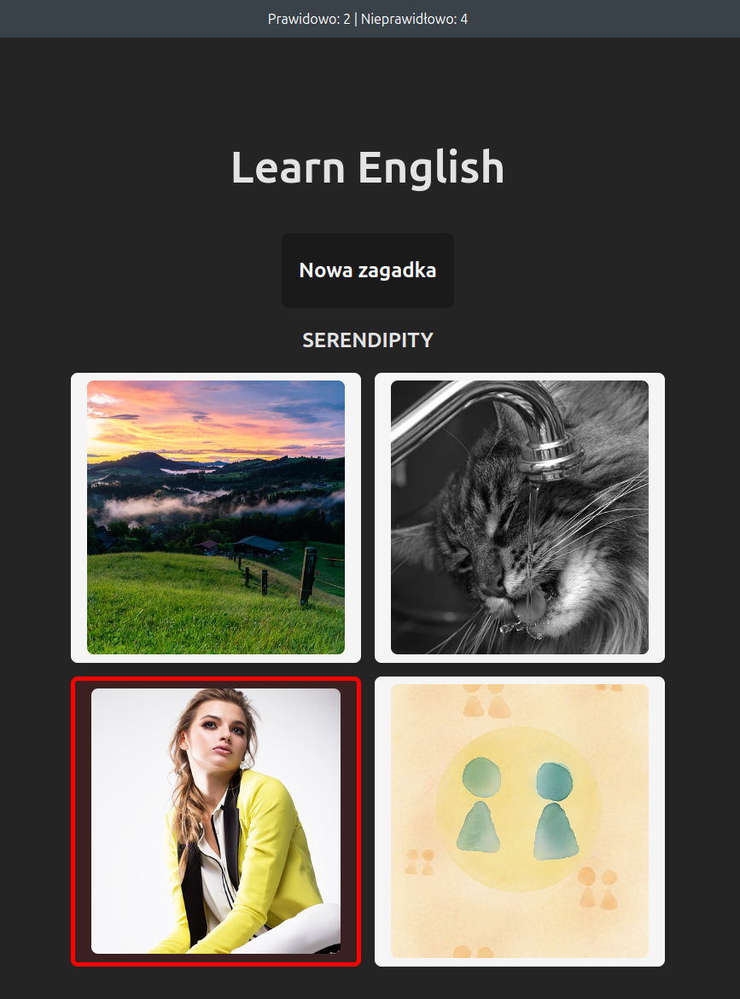

= Learn English

Simple "game" done as a webapp to teach my daughter some english words.

It's been developed in TypeScript with React+Vite and NestJS.

== Rationale

I wanted a challenge - in 1 hour write a webapp as a fullstack.

And I did, tremendously wrong. This is a result of 1h crunch at midnight.

== Result

Working app. I'm kinda proud. Daughter is excited to play with it. Was fun. Will fullstack again.