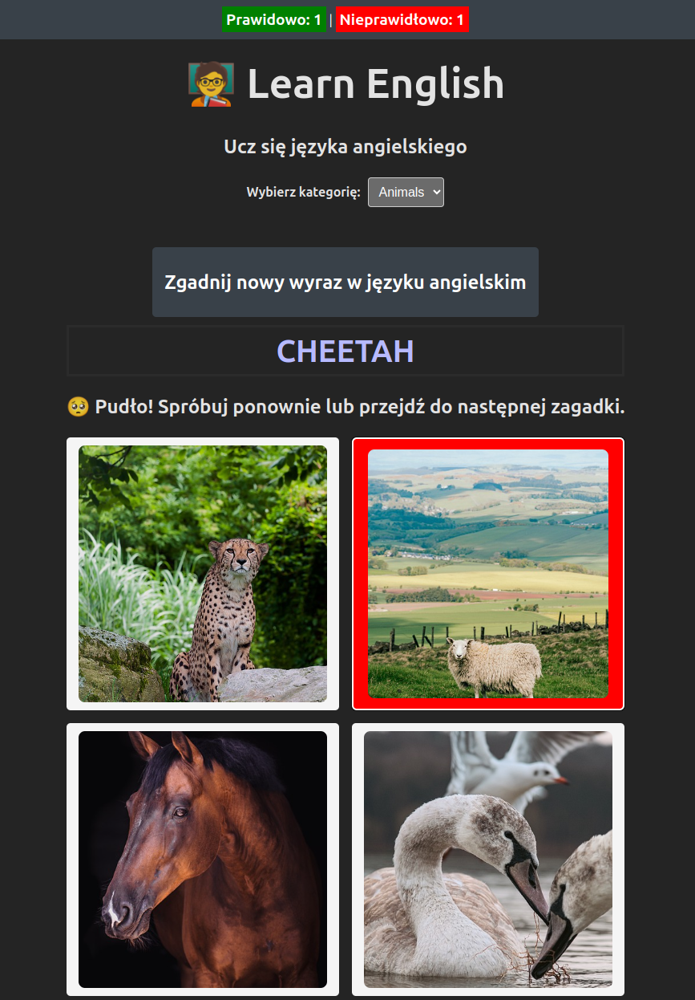

= Learn English

Simple "game" done as a webapp to teach my daughter some english words.

It's been developed in TypeScript with React+Vite and NestJS.

== Game goal

Player is presented with four pictures and single word. Score is given if user answers according to correct or false answer.

== Rationale

I wanted a challenge - in 1 hour write a webapp as a fullstack.

And I did, tremendously wrong. This is a result of 1h crunch at midnight.

== Result

Working app. I'm kinda proud. Daughter is excited to play with it. Was fun. Will fullstack again.

== Installation

Clone repository, install devenv.sh, run:

[source,shell]
----
devenv up
----

You should see API working on http://localhost:8080 and UI on http://localhost:5173

== Testing

Run:

[source,shell]
----
devenv test
----

== Development

Run:

[source,shell]
----
devenv up
----